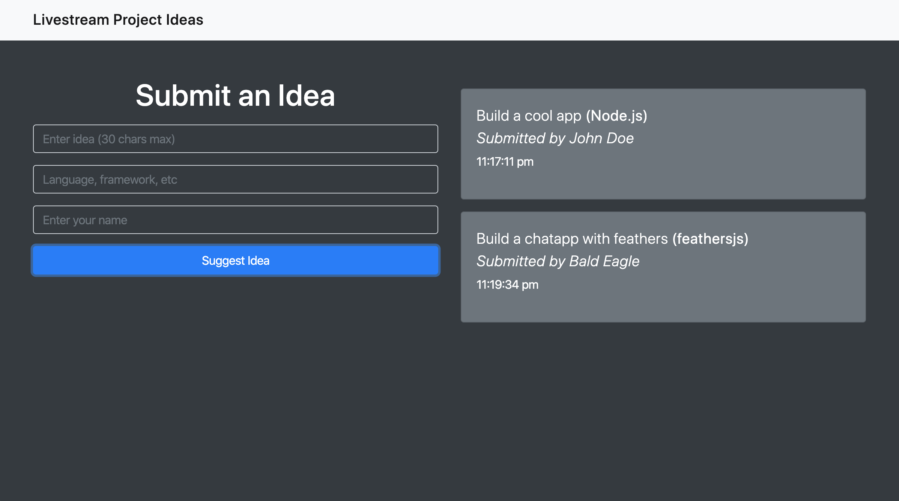

# livestreamapp

Simple app for coding livestreamers to have viewers send in project ideas in real-time using Feathersjs, Momentjs, Express and SocketIO.

Run `npm install` and `npm start` to run the server and be able to add ideas and see it show up on the user interface.

**CREDIT to TRAVERSY MEDIA For the tutorial**
